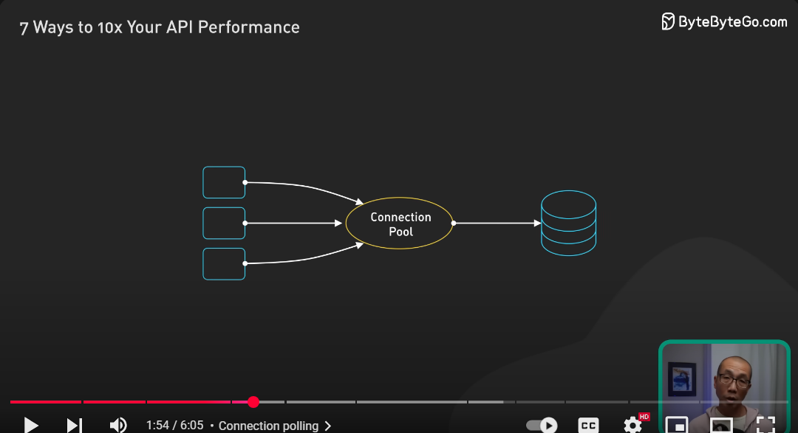
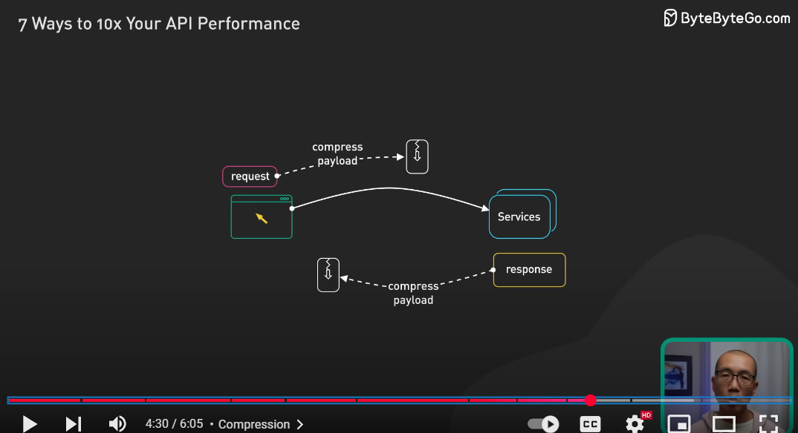

# 🧠 Complete Best Practices & Architecture Guide for FastAPI Projects

---

## 🧱 1. Project Structure

```
project/
├── app/
│   ├── api/              # APIRouters grouped by version/resource
│   │   └── v1/
│   │       └── items.py
│   ├── core/             # App-wide config, constants, startup, shutdown
│   ├── models/           # ORM models (SQLAlchemy or Tortoise)
│   ├── schemas/          # Pydantic models (request/response)
│   ├── services/         # Business logic
│   ├── repositories/     # Data-access layer (CRUD abstraction)
│   ├── db/               # DB engine/session connection
│   ├── dependencies/     # Custom reusable Depends() logic
│   └── utils/            # Common helper functions
├── tests/                # Unit and integration tests
├── main.py               # FastAPI app entrypoint
├── .env / .env.example   # Environment config
├── requirements.txt
└── README.md
```

✅ Optional: Domain-Driven Design structure with `/domain/item`, `/domain/user`, etc.

---
## 2. 🧠 Coding Best Practices & Clean Code

### ✅ Code Clarity
- Follow **PEP8** formatting.
- Use **type hints** (`str`, `int`, `Annotated`, etc.).
- Use **clear, consistent naming** (e.g., plural route names: `/items/`, not `/item/`).
  

### ✅ Avoid Code Smells (Refactoring Guru):
- **Long functions** → split into smaller helpers.
- **Duplicated logic** → use dependency injection or service layer.
- **Tight coupling** → abstract DB logic into repositories/services.
- **Inconsistent naming** → follow RESTful and Python conventions.
- **God object** → split large classes or files by responsibility.
---
## 🧪 3. Testing


- Override dependencies with `app.dependency_overrides[...]`
- Use `pytest`, `fixtures`, factory functions
- Cover: valid flows, edge cases, auth failures, validation errors
- Use `TestClient` for full request/response testing:

Using `TestClient`, test the following:

  - Routes (status code, response schema)
  - Validation (400s on bad input)
  - Business logic


### ✅ Sample `test_main.py`

```python
from fastapi.testclient import TestClient
from app.main import app

client = TestClient(app)

def test_create_item():
    response = client.post("/api/v1/items", json={"name": "Test", "price": 10.0})
    assert response.status_code == 200
    assert response.json()["name"] == "Test"
```

---

## 🧬 4. Dependency Injection (`Depends()`)

```python
def get_db():
    db = SessionLocal()
    try:
        yield db
    finally:
        db.close()

@app.get("/items")
def get_items(db: Session = Depends(get_db)):
    ...
```

- Use for DB session, auth, Pagination/query filter logic
- Chain dependencies: `get_current_user`, then `get_admin_user`
- Improves testability & modularity
- Use in services too (not just routes)

---

## 🧼 5. Clean Code & Design Principles

- Use `Annotated[]`, `Field()`, `BaseModel`
- Avoid:
  - God classes/modules
  - Long functions
  - Duplicate code
- Follow SOLID: Single Responsibility, Open/Closed, etc.
- Keep route handlers thin (delegate to services)
- Consistent naming: plural nouns, snake_case in Python, kebab-case in URLs
    
    

  ### ✅ Linting & Formatting
- Use `ruff` for linting and formatting

### ✅ Git & Version Control
- Use GitHub repo for hosting and version tracking
- Write clean commit messages
- Use `.gitignore`

### ✅ CI/CD (Optional for now)
- Add GitHub Actions for:
  - Testing on push
  - Linting/formatting check

---

## 🗂️ 6. Pydantic Usage

```python
class Item(BaseModel):
    name: str = Field(..., min_length=1)
    price: float = Field(..., gt=0)

    class Config:
        orm_mode = True
```

- Separate `schemas` from `models`
- Use inheritance: `BaseItem`, `ItemCreate`, `ItemRead`
- Use `Config.orm_mode = True` for DB serialization
- Include examples via `Config.schema_extra`

---

## 🔁 7. API Design Best Practices

- Use nouns in paths: `/items/`, `/orders/{order_id}`
    
- Version APIs: `/api/v1/...`
    
    
- * Use **clear query strings** for filtering and sorting:
  * Example: `?sort_by=registered`
  * Example: `?filter=color:blue`
  
  
  
  
  
  
    
- Support:
  - Pagination: `?limit=20&offset=0`
    - **Offset-based** (`limit`, `offset`) — simple but can be slow on large datasets
    
    
    
    
    
    
    -**Cursor-based** — scalable, tracks changes better
  - Filtering: `?status=active`
  - Sorting: `?sort=-created_at`
- Idempotency for PUT, DELETE:
  -`GET`: naturally idempotent
  - `PUT`, `DELETE`: should be idempotent
  - `POST`: not idempotent by default — implement safeguards (client-generated IDs)
  - `PATCH`: not guaranteed idempotent — document behavior
  
  
  
  
  
  
- Return appropriate status codes

- Use consistent, clear URL patterns:
  - Plural nouns for collections (`/users/`)
  - Forward slashes (`/`) for hierarchy
  - Hyphens (`-`) for multi-word segments
- Keep cross-resource references simple
- Plan for **rate limiting** to protect from abuse and DDoS attacks
    
    
    
    
---

## 🛡️ 8. Security

- Use `Depends(get_current_user)` for secured endpoints
- Auth options: OAuth2 + JWT, API keys
- Don't expose stack traces
- Validate everything with Pydantic
- CORS: restrict origins in production
- Plan for **rate limiting**:
  - Per-IP, per-user, per-endpoint quotas
  - Example: Free users 1000 requests/day, 20 req/min/IP
- **Security should not be an afterthought:** integrate from the start

  - Enforce authentication/authorization consistently
  - Use HTTPS everywhere
  - Monitor dependencies for CVEs

---

## ⚙️ 9. Config & Environments

```python
from pydantic_settings import BaseSettings

class Settings(BaseSettings):
    DB_URL: str
    DEBUG: bool = False

    class Config:
        env_file = ".env"

settings = Settings()
```

- Centralize config in `core/config.py`
- Load secrets via `.env`
- Provide `.env.example` for reference
- Inject config with `Depends(get_settings)`

### ✅ Environment Management
- Use `.env` and `pydantic.BaseSettings` for:
  - Secrets
  - DB URIs
  - API keys

### ✅ Config Loader
- Centralize config in a file like `settings.py` or `config.py`


---

## 🚀 10. Performance & Optimization
  

* Use `async def` + `await` for all I/O operations
* Use async DB drivers (SQLAlchemy 2.0+ async, Tortoise ORM)
* Avoid blocking I/O in event loop: use `run_in_threadpool()` where needed
* **Avoid N+1 queries:** use `selectinload()`, efficient joins
  
  
  
* **Enable connection pooling** to avoid repeated DB handshake overhead
    
    
      
* **Use caching:** Redis, Memcached, or local LRU for frequently accessed data
    
    
      
* **Pagination:** implement offset-based *and/or* cursor-based pagination (cursor preferred for large dynamic datasets)
* Enable compression (Gzip or Brotli) on large responses
  
  
  
  
* Use **lightweight JSON serializers** (e.g. `orjson`) for faster JSON encoding
  
  
* Use **asynchronous logging** in high-throughput systems to avoid blocking I/O
  
  
  
  
* Use background tasks for expensive post-response processing
---

## 🧾 11. Logging & Error Handling

```python
@app.middleware("http")
async def add_process_time_header(request: Request, call_next):
    start = time.time()
    response = await call_next(request)
    duration = time.time() - start
    response.headers["X-Process-Time"] = str(duration)
    return response
```

- Use `logging.config.dictConfig` for structured logs
- For high-performance systems, implement **asynchronous logging** (background log writing)

  - Be aware of slight risk of log loss if app crashes before flush
- Customize error handlers: `HTTPException`, `RequestValidationError`
- Avoid exposing internal stack traces
- Use correlation IDs for tracing requests


---

## 📚 12. Documentation & Developer Experience

- Auto docs via Swagger (`/docs`) and ReDoc (`/redoc`)
- Use:
  - `summary=`, `description=`, `tags=[...]`
  - `response_model=`
- Add examples in Pydantic models
- Disable docs in production if private

---

## 🧩 13. Advanced Features (Optional)

- `BackgroundTasks` for async post-response jobs
- `orjson` or `ujson` for faster JSON encoding
- Middleware: logging, metrics, auth
- Add `repositories/` and `services/` layers for Clean Architecture
- Domain folders (`/domain/user`, etc.) for scaling

---

## ⛔ Common Pitfalls

| Mistake                     | Solution                              |
| --------------------------- | ------------------------------------- |
| One large `main.py`         | Split with APIRouters                 |
| Blocking I/O in async route | Use async or threadpool               |
| Skipping validation         | Use Pydantic + `Field()`              |
| No pagination               | Use `limit`, `offset` or cursor-based |
| Exposed internals           | Customize error messages              |
| Unauthenticated routes      | Secure with `Depends()`               |
| No tests                    | Use `pytest`, `TestClient`            |
| No versioning               | Prefix routes with `/api/v1/`         |
| Wildcard CORS               | Only allow trusted origins            |

## General API Engineering Tips

* Use clear and consistent naming in URLs:
  
  * Plural nouns for collections (`/users/`)
  * Forward slashes (`/`) to indicate hierarchy
  * Hyphens (`-`) instead of underscores for multi-word segments
* Plan for future API versions — adopt versioning from day one
* Document idempotency behavior clearly per endpoint
* Use `.env` files for configuration (e.g. `python-dotenv`, `pydantic.BaseSettings`)
* Use Alembic for DB migrations (if using relational DB)
* Automate CI/CD pipelines — include tests and lint checks
---
