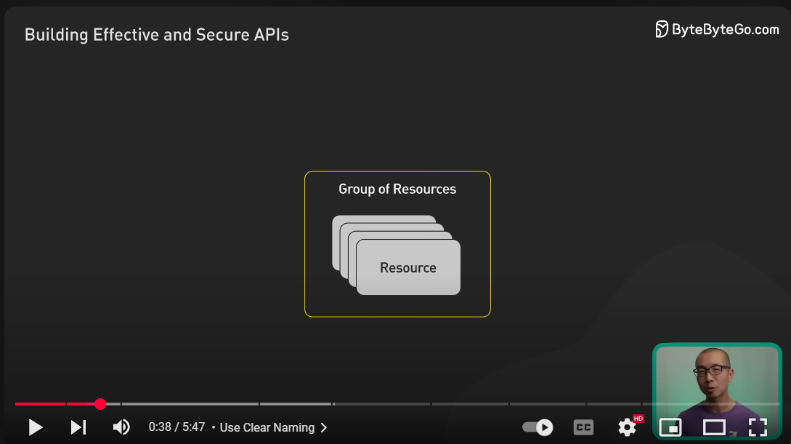

---
## 2. 🧠 Coding Best Practices & Clean Code

### ✅ Code Clarity
- Follow **PEP8** formatting.
- Use **type hints** (`str`, `int`, `Annotated`, etc.).
- Use **clear, consistent naming** (e.g., plural route names: `/items/`, not `/item/`).
  

### ✅ Avoid Code Smells (Refactoring Guru):
- **Long functions** → split into smaller helpers.
- **Duplicated logic** → use dependency injection or service layer.
- **Tight coupling** → abstract DB logic into repositories/services.
- **Inconsistent naming** → follow RESTful and Python conventions.
- **God object** → split large classes or files by responsibility.
---
## 🧪 3. Testing


- Override dependencies with `app.dependency_overrides[...]`
- Use `pytest`, `fixtures`, factory functions
- Cover: valid flows, edge cases, auth failures, validation errors
- Use `TestClient` for full request/response testing:

Using `TestClient`, test the following:

  - Routes (status code, response schema)
  - Validation (400s on bad input)
  - Business logic


### ✅ Sample `test_main.py`

```python
from fastapi.testclient import TestClient
from app.main import app

client = TestClient(app)

def test_create_item():
    response = client.post("/api/v1/items", json={"name": "Test", "price": 10.0})
    assert response.status_code == 200
    assert response.json()["name"] == "Test"
```

---


## 🧼 5. Clean Code & Design Principles

- Use `Annotated[]`, `Field()`, `BaseModel`
- Avoid:
  - God classes/modules
  - Long functions
  - Duplicate code
- Follow SOLID: Single Responsibility, Open/Closed, etc.
- Keep route handlers thin (delegate to services)
- Consistent naming: plural nouns, snake_case in Python, kebab-case in URLs
    
    
