# Connecting to database from local

## FastAPI Flow Local
### Overview

```mermaid
graph TD
    A["🧑‍💻 Browser / Client<br/>Example: 127.0.0.1:8000"]
    B["🌀 Uvicorn<br/>ASGI Server"]
    C["🚀 FastAPI App"]
    D["📦 Route Handler<br/>@app.get('/')"]
    E["📤 JSON Response"]

    A --> B
    B --> C
    C --> D
    D --> C
    C --> E
    E --> B
    B --> A
```


### Detailed


## Underlying code

FastAPI stiches multiple libraries together, such as Starlette, Pydantic, Typing, etc.
In this structure, the decorator `@app.get("/")` from FastAPI is equivalent to `Route("/", root, methods=["GET"])` in Starlette.
Consider the following simple code for sending a JSON response:

```python
from fastapi import FastAPI

app = FastAPI()
@app.get("/")
async def root():
    return {"message": "Hello World"}
```

The equivalent manual version (and without using decorators) would be following

```python
from fastapi import FastAPI
from fastapi.routing import APIRoute
from starlette.requests import Request
from starlette.responses import JSONResponse

app = FastAPI()

# Define the route handler function
async def root(request: Request):
    return JSONResponse({"message": "Hello World"})

# Create and add the route explicitly
route = APIRoute(
    path="/",
    endpoint=root,
    methods=["GET"],
    name="root"
)
app.router.routes.append(route)
```

## Resources
- [Best Practices (MVC)](https://stackoverflow.com/questions/64943693/what-are-the-best-practices-for-structuring-a-fastapi-project)
- [Achieve MVC in FastAPI](https://verticalserve.medium.com/building-a-python-fastapi-crud-api-with-mvc-structure-13ec7636d8f2)
- [MVC pattern template](https://github.com/iam-abbas/FastAPI-Production-Boilerplate)
- [Minimalistic but professional template](https://github.com/luchog01/minimalistic-fastapi-template)
- [sqlmodel library: for patching SQLAlchemy with Pydantic](https://github.com/fastapi/sqlmodel)
- [sqlmodel library docs](https://sqlmodel.tiangolo.com/)
